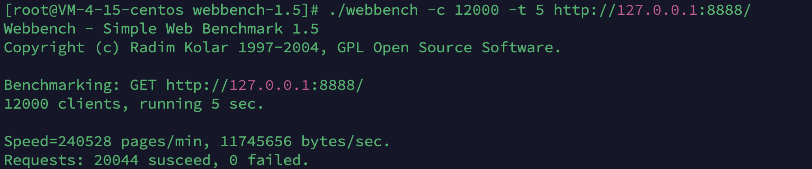

# MEGA Server(高并发C++ WebServer)

Linux下C++轻量级Web服务器

- 使用 **线程池 + 非阻塞socket + epoll(ET模式) + 事件处理(Reactor)** 的并发模型
- 实现**同步/异步日志系统**，记录服务器运行状态
- 基于**小根堆的定时器模块**，定时出炉非活跃连接
- 使用**状态机**解析HTTP请求报文，支持解析**GET和POST**请求
- 使用RAII机制优化数据库连接的获取与释放，互斥锁实现线程安全
- 访问服务器数据库实现用户**注册、登录**功能，可以请求服务器**图片和视频文件**
- 实现**同步/异步日志系统**，记录服务器运行状态
- 经Webbench压力测试可以实现4000QPS（同环境下Nginx QPS=20000），实现上完的并发连接的数据处理

## 目录树

```
mega/
|-- main.cpp                  程序主入口
|-- Makefile
|-- README.md
|-- resources                 静态资源文件
|-- src                       源代码
|   |-- buffer                缓冲区模块
|   |   |-- Buffer.cpp
|   |   `-- Buffer.h
|   |-- http                  Http Request模块 和 Http Response模块
|   |   |-- HttpRequest.cpp
|   |   |-- HttpRequest.h
|   |   |-- HttpResponse.cpp
|   |   `-- HttpResponse.h
|   |-- log                   日志模块
|   |   |-- BlockQueue.h
|   |   |-- Log.cpp
|   |   `-- Log.h
|   |-- pool                  数据库连接池模块 和 线程池模块
|   |   |-- SqlConnectionPool.cpp
|   |   |-- SqlConnectionPool.h
|   |   |-- SqlConnectionRAII.h
|   |   `-- ThreadPool.h
|   |-- server                服务模块
|   |   |-- Epoller.cpp
|   |   |-- Epoller.h
|   |   |-- HttpConnection.cpp
|   |   |-- HttpConnection.h
|   |   |-- Util.cpp
|   |   |-- Util.h
|   |   |-- WebServer.cpp
|   |   `-- WebServer.h
|   `-- timer                  定时器模块
|       |-- HeapTimer.cpp
|       `-- HeapTimer.h
`-- start.sh                   后台启动脚本
|-- server                     编译后前台脚本
|-- shutdown.sh                关闭后台执行脚本
```

## 环境

* CentOS 7.6 / Ubuntu 22.04
* C++ 17
* MySQL 8
* Git

## 使用

```bash
创建数据库：create database YOUR_DATABASE;

创建数据表：
USE YOUR_DATABASE;
CREATE TABLE user(
    username char(50) NULL,
    password char(50) NULL
)ENGINE=InnoDB;

添加数据
INSERT INTO user(username, password) VALUES('YOUR_NAME', 'YOUR_PASSWORD');

编译：make
前台开启服务：./server
后台开启服务：./start.sh
关闭后台服务：./shutdown.sh
```

## WebBench

测试环境：腾讯云轻量应用服务器 CentOS 7.6 4核 4GB




